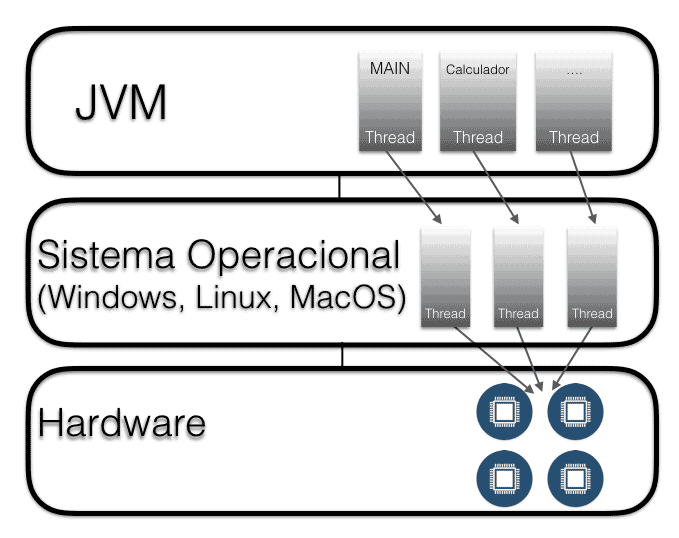
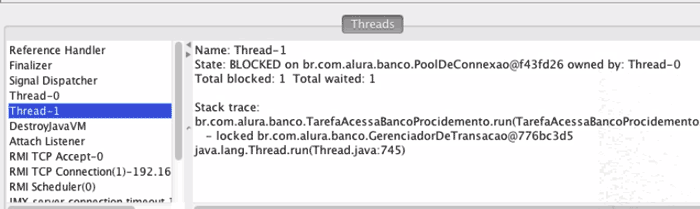

# Threads basico

Através das Threads podemos executar tarefas em paralelo e para sua criação é necessário implementar a interface Runnable 

O construtor da classe Thread recebe esse Runnable e devemos inicializar uma Thread explicitamente através do método start();
O Thread.sleep(millis) podemos mandar uma thread "dormir".

Java mapeia os Threads para o Sistema Operacional e a ordem de execução depende da JVM e não do nosso código 

Não temos controle sobre qual thread realmente começa a execução e para sincronizar o acesso ao objeto, utilizamos a palavra chave synchronized. Tudo que estiver dentro do bloco syncronized só poderá ser executado através de um único thread. <i>Como se todas as threads pudessem bater na porta pra serem executadas, mas so quem estiver na vez, ou seja, dentro do syncronized será executado</i>
<b>O synchronized significa que bloqueamos o objeto para outros threads</b>
Os comandos dentro do bloco serão executados de maneira atômica, também chamado de <b>Mutex</b> que nada mais é do que a chave do objeto.

Thread safe significa que o código funciona corretamente mesmo com vários threads compartilhando o objeto;
Há coleções thread safe, como o java.util.Vector para lista ou java.util.Hashtable para mapas.

No pacote de lista, a ideia é teremos uma lista com capacidade de 100 elementos, e 10 threads que adicionam 10 elementos cada. 

Logo, na classe lista do nosso projeto estamos simulando uma classe "lista" na qual temos uma quantidade fixa de elementos (100), um índice que identifica a posição na lista e três métodos:

* o método adicionaElementos(), que recebe uma String, adiciona o elemento no índice atual e o incrementa;
* o método tamanho(), que devolve o tamanho total da lista;
* o método pegaElemento(), que retorna um elemento com base na posição dele.

Para que ao executar a lista seja populada na execução das threads, lançamos o syncronized na assinatura do método e para sincronizar as duas listas podemos utilizar:
List<String> lista = Collections.synchronizedList(new ArrayList<String>());
ou
List<String> lista = new Vector<String>();

Quando um objeto está em execução, sua chave está sendo executada e precisa entrar num modo em que a chave seja devolvida e que uma proxima thread possa ser executada, pra isso temos o metodo <i>wait() </i>. Acordar os threads que estão no estado waiting chama-se notificar. Podemos notificar todos os threads através do método notifyAll() e só podemos chamar notifyAll() dentro de um bloco sincronizado. Quando chamamos wait() ou notify() fora de um método ou bloco synchronized, é jogado uma exceção em tempo de execução do tipo java.lang.IllegalMonitorStateException.
<i><b> Os método wait() e notify() vem da classe Object. Todos os objetos possuem esses métodos.</b></i>

Podemos também fazer com que metodos fiquem em um constante estado de prontidão para execução a partir de uma determinada ação / verificação. Assim sendo, podemos definir threads que dependam de outros ou só deveriam rodar enquanto outros existem. Esse tipo de thread se chama <b>Daemon.</b>
Podemos definir o thread através do método setDaemon(true)

>Threads daemon são como prestadores de serviços para outras threads. Elas são usadas para dar apoio à tarefas e só são necessárias rodar quando as threads "normais" ainda estão sendo executadas. Uma thread daemon não impede a JVM de terminar desde que não existem mais threads principais em execução. Um exemplo de uma thread daemon é o coletor de lixo da JVM (Garbage Collector)

<code>
    Thread thread = new Thread(runnable);
    thread.setDaemon(true);
    thread.start();
</code>

<em>Daemons serão automaticamente desligados quando todas as outras threads terminarem </em>

Entendendo Deadlock

Um thread impede a execução do outro, pois cada um possui a chave de um objeto que o outro precisa para continuar. Temos um impasse e esse impasse é chamado de deadlock.

Para resolver o problema, devemos sempre obter as chaves na mesma ordem. Ambos os blocos devem primeiro tentar obter a chave do pool e só depois a chave do gerenciador de transação.

Obs: Somente as threads envolvidas no deadlock ficam paradas.
